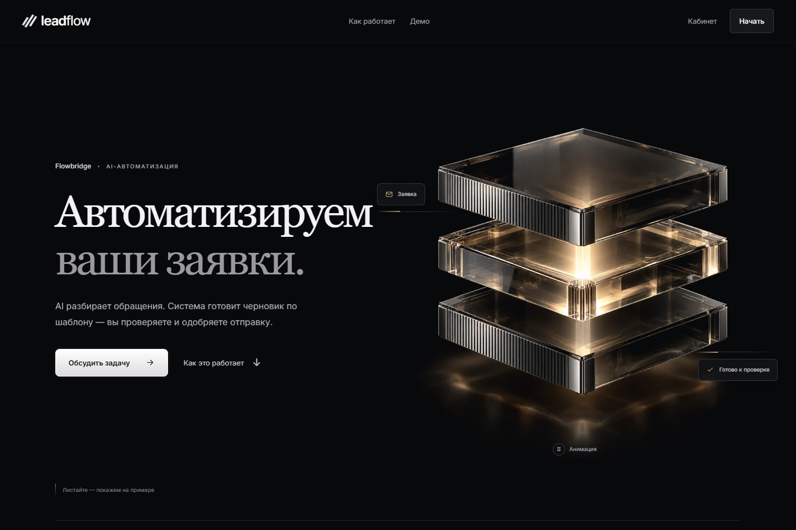
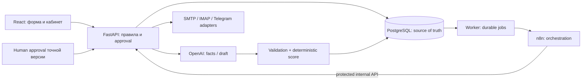
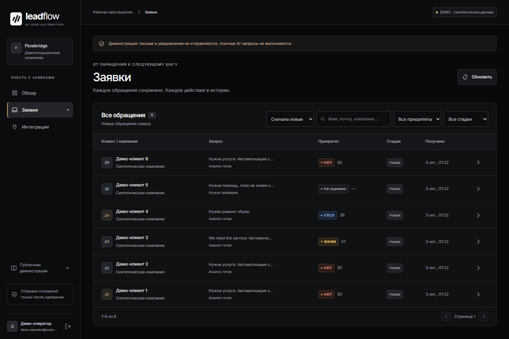
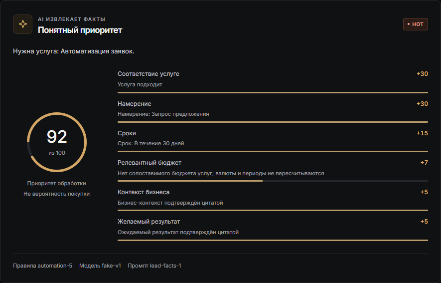
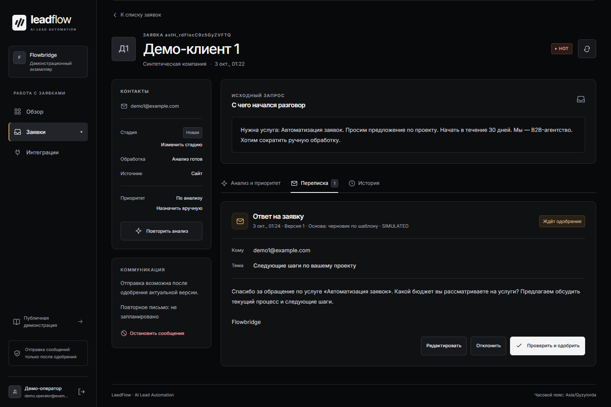
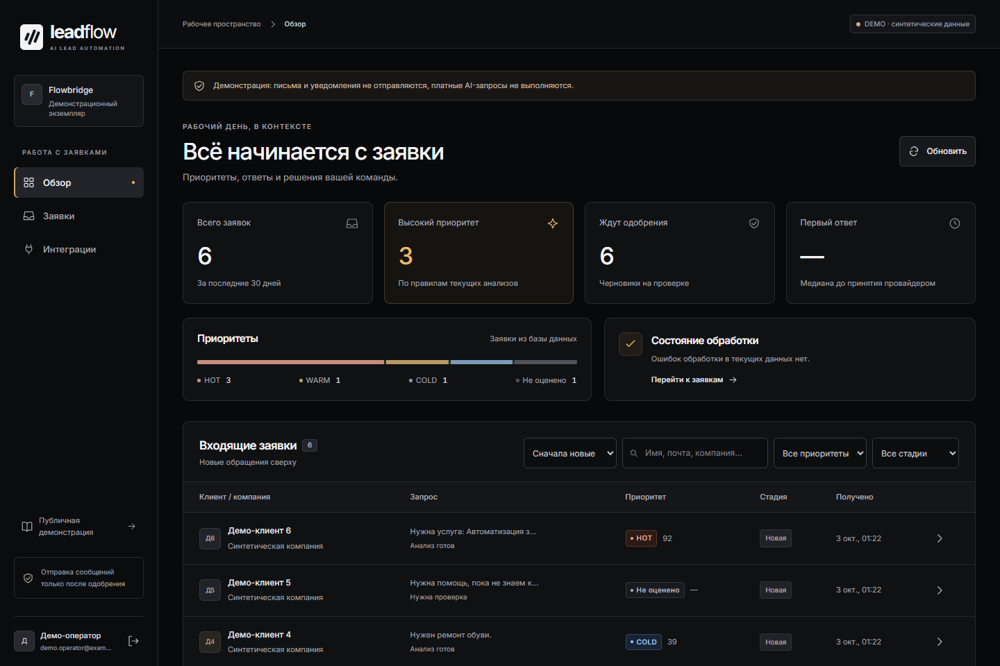

# Flowbridge — AI Lead Automation System

## Overview

Flowbridge — portfolio-проект для обработки входящих B2B-заявок в одном бизнесе. Система сохраняет обращение, извлекает проверяемые AI-факты, рассчитывает приоритет и готовит ответ для одобрения менеджером. **v1 FROZEN**; обычный demo работает на synthetic данных и fake провайдерах.



Главная страница локального demo: предложение, описание процесса и следующий шаг.

## Business Problem

В типовом процессе заявки приходят через форму, менеджер переносит данные, вручную квалифицирует обращение и пишет ответ. Важные лиды могут ждать, а сведения — теряться между инструментами. Это постановка задачи проекта, а не описание реального клиента или подтверждённого коммерческого внедрения.

## Solution

Lead → FastAPI validation → PostgreSQL + durable Job → worker → n8n orchestration → OpenAI structured analysis → schema/semantic validation → deterministic scoring → HOT/WARM/COLD → personalized draft → human approval → communication layer.

При неизвестных фактах или ошибках система сохраняет необходимость проверки оператором. Генерация текста не разрешает отправку.

## Architecture



PostgreSQL хранит прикладное состояние; backend владеет валидацией, scoring и переходами состояний. n8n оркестрирует и планирует операции, не пишет application DB и не дублирует правила. OpenAI не определяет final score. Транзакции закрываются перед сетевыми вызовами; клиентское письмо требует approval конкретной неизменяемой версии.

## Key Features

- Validated intake, idempotency, атомарные Lead + Job в PostgreSQL.
- Durable jobs: claims, leases, generations, fencing и recovery; n8n orchestration.
- Strict AI facts с evidence, schema + semantic validation; deterministic HOT/WARM/COLD.
- Personalized draft, immutable MessageVersion/provenance; редактирование сбрасывает approval.
- SMTP adapter с delivery_unknown, IMAP reply correlation и Telegram notification adapter. Код существует; live verification отложена до разрешённого клиентского пилота.
- Один follow-up с отдельным approval и stop/reply/opt-out gates.
- Защищённый кабинет, аналитика событий, отдельные demo/controlled/live режимы, privacy/security guards.

## AI Safety / Reliability

Structured Outputs проверяются Pydantic и серверным semantic validator. Evidence должна соответствовать исходному фрагменту; безопасный Unicode/casefold не разрешает пересказ. Текст заявки — untrusted data; AI не получает полномочий approve/send. Бюджеты сравнивает Decimal, score считает backend.

Human review обязателен: schema validity не доказывает фактическую полноту. Неопределённый SMTP outcome запрещает слепой resend. Usage, provider/model/prompt version и provenance сохраняются вместе с результатом; неизвестная стоимость не записывается нулём. Controlled real analysis и draft проверены отдельно, по одному разрешённому запросу; повторные live calls запрещены.

## Verification Status

| Компонент | Статус и граница |
|---|---|
| Real OpenAI analysis | VERIFIED controlled: HTTP 200, schema/semantic passed, 95/HOT |
| Real OpenAI draft | VERIFIED controlled: schema/content passed, draft, human approval required, sent=false |
| Scoring | VERIFIED: deterministic server-side |
| Human approval | VERIFIED: точная версия/получатель, edit invalidation, replay/concurrency |
| SMTP | IMPLEMENTED; live UNVERIFIED/BLOCKED |
| Telegram | IMPLEMENTED; live UNVERIFIED/BLOCKED |
| IMAP | IMPLEMENTED; live UNVERIFIED/BLOCKED |
| Deployment | Local VERIFIED; production target environment pending; Docker config проверен статически, runtime UNVERIFIED |

Модель controlled проверок: `gpt-4.1-mini-2025-04-14`. Real draft verification cost — **$0.000626 по usage**, стоимость одного synthetic ответа, не оценка production расходов. Найденный sender/client subject defect исправлен бесплатно: `sender_business_name`, neutral subject при неизвестном клиенте и общий sender-brand gate. Текущий draft prompt `lead-draft-2` проверен только локально; повторного paid/live запроса не было. Маленькая выборка не доказывает качество всех обращений.

## Tech Stack

| Слой | Технологии |
|---|---|
| Backend | Python 3.12, FastAPI, Pydantic, SQLAlchemy, PostgreSQL, Alembic |
| AI | OpenAI API, Structured Outputs, validated schema, deterministic scoring |
| Automation | n8n |
| Frontend | React, TypeScript, Vite |
| Testing | Pytest + PostgreSQL, Playwright, Vitest, Ruff |
| Infrastructure | Windows local setup; Docker/Linux deployment materials |

Версии зафиксированы в `requirements.lock` и npm lockfiles. Зависимости автоматически не обновляются.

## Tests

Финальная бесплатная приёмка: **457 backend tests passed**, 0 failed/skipped; Ruff check/format check и pip check PASS. Frontend build/lint/typecheck PASS, **16 unit tests passed**. Alembic check выполнен только на отдельной test DB. Browser tests существуют, но в текущей приёмке не запускались: они создают demo-данные. На этом Windows host pytest вывел WMI diagnostic 0x8007000e во время Mock SDK headers, при exit 0 и всех passed; подробности не скрыты. Полные команды, результаты и оговорки — [verification.md](docs/verification.md).

## Project Scope

Single-company-per-deployment v1: один бизнес, его услуги и оператор. Это не multitenant SaaS, billing platform или full CRM. Live external credentials и реальные коммуникации требуют отдельного клиентского пилота. RAG, новые каналы и автономная клиентская переписка не входят в v1.

## Demo Video

[▶ Watch Flowbridge — AI Lead Automation Demo](https://youtu.be/YuSKgCZu7Y8)

[](https://youtu.be/YuSKgCZu7Y8 "Flowbridge — AI Lead Automation System | Project Demo")

A short product demonstration showcasing:

- Lead management and prioritization
- Structured lead analysis
- Deterministic HOT/WARM/COLD scoring
- Response drafts with human approval
- Dashboard and analytics

The interface uses synthetic data and simulated providers.
Real OpenAI analysis and draft generation were verified
separately in a controlled environment.

[Сценарий на 3 минуты](docs/PORTFOLIO_DEMO.md) · [Описание для CV/HH/LinkedIn](docs/PORTFOLIO_PROJECT_DESCRIPTION.md) · [План кадров](docs/PORTFOLIO_SCREENSHOTS.md).

## Screenshots

Все кадры показывают локальный demo с synthetic данными и fake провайдерами. **Demo lead на скриншотах — 92/HOT**; отдельная **controlled real OpenAI verification — 95/HOT**, описанная в Verification Status, не изображена на этих кадрах.

### Заявки и кабинет оператора

Сохранённые synthetic обращения, приоритеты HOT/WARM/COLD и текущие стадии.


### Структурированный анализ и детерминированный score

Demo-анализ модели `fake-v1`: 92/HOT и вклад каждого критерия в серверную оценку.



### Черновик с обязательным одобрением человеком

Шаблонный demo-ответ ждёт проверки актуальной версии оператором. Письмо не отправлено.



### Аналитика

Число synthetic заявок, распределение приоритетов и черновики на одобрении.



## Run Locally

Нужны Windows PowerShell, Python 3.12 и Node.js 24. Команды ниже предназначены для **нового локального demo** из корня проекта; на уже подготовленном экземпляре используйте только `scripts/start-dev.ps1`. Обычный demo не требует OpenAI API key и не отправляет реальных сообщений.

```powershell
python -m venv .venv
.\.venv\Scripts\python.exe -m pip install -r requirements.lock
.\.venv\Scripts\python.exe -m pip install --no-deps -e .
npm.cmd ci --prefix frontend
.\n8n\install-local.ps1
.\.venv\Scripts\python.exe -m app.cli init-env
.\scripts\start-postgres.ps1
.\.venv\Scripts\python.exe -m alembic upgrade head
.\.venv\Scripts\python.exe -m app.cli init-demo-operator
.\scripts\start-n8n.ps1 -Setup
.\scripts\start-dev.ps1
```

`init-env` генерирует локальные служебные tokens и отказывается перезаписывать существующий файл. Operator credentials сохраняются вне repository/OneDrive в `%LOCALAPPDATA%/AILeadAutomationPro/demo-operator.json`; не публикуйте их. Для заранее подготовленных synthetic примеров есть `python -m app.cli seed-demo`.

Откройте `http://127.0.0.1:5173/`; read-only demo — `/#/demo`, защищённый кабинет — `/#/app`. Это локальные адреса, не публичная поставка. Детали: [n8n](docs/n8n.md), [PostgreSQL](docs/postgres-local.md), [deployment](docs/DEPLOYMENT.md). Controlled analysis/draft smoke повторно не запускать.

## Repository Structure

```text
backend/app/       API, domain rules, adapters, worker, approval
backend/tests/     free unit + PostgreSQL integration tests
backend/migrations/ Alembic
frontend/          React UI, unit/browser tests
n8n/               четыре portable workflows и local launcher
config/            business YAML
evaluation/       frozen synthetic cases и evaluator config
scripts/           local setup/operations
docs/             architecture, verification, portfolio, pilot
```

Приватные `.env`, `.local`, runtime DB/keys/PIDs/logs, node_modules, generated artifacts и исторические owner reports исключены из Git. Synthetic Mock report в `backend/tests/fixtures` не является real provider evidence.

## Remaining Client-Pilot Work

- Разрешённая проверка реальных клиентских SMTP/Telegram/IMAP.
- Приёмка business config, качества, privacy/retention и cost limits клиента.
- Проверка HTTPS, access roles и закрытой целевой среды.
- Backup/restore/rollback в целевой среде.
- Фиксация поставляемой ревизии.

[AUDIT / готовность GitHub](docs/PORTFOLIO_AUDIT.md) · [Итоговая матрица v1](FINAL_PROJECT_REPORT.md) · [Архитектура](docs/architecture.md) · [Обучение](docs/learning.md) · [Pilot checklist](docs/PILOT_CHECKLIST.md).
