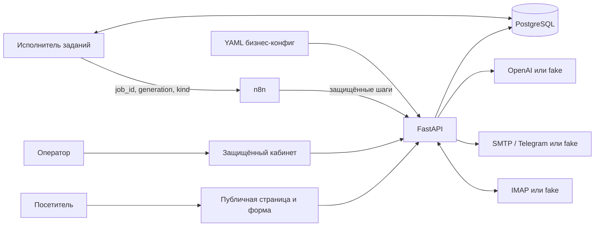

# Архитектура и границы гарантий

Система обслуживает одну компанию на развёртывание. Backend владеет правилами,
PostgreSQL — состоянием, n8n — последовательностью вызовов и расписанием.
Исполнитель из того же Python-проекта доставляет сохранённые задания в n8n.

## Владельцы операций

| Операция | Код | Сохранённый результат |
|---|---|---|
| Валидация и приём | `backend/app/schemas.py`, `intake.py` | Lead и Job в одной транзакции |
| Сессии, CSRF, служебный доступ | `backend/app/security.py` | Хеш токена сессии, срок, оператор |
| Доставка задания | `backend/app/worker.py`, `jobs.py` | Поколение, lease, число попыток |
| AI, scoring, черновик | `backend/app/processing.py`, `domain/`, `adapters/ai.py` | Analysis, версия правил, usage, MessageVersion |
| Одобрение и редактирование | `backend/app/admin.py` | Неизменяемая версия и Approval |
| Отправка, входящие, follow-up | `backend/app/communication.py` | Состояние Message, IMAP-курсор, Audit |
| Последовательность и расписание | `n8n/workflows/*.json` | Прикладное состояние остаётся в PostgreSQL |
| Отображение | `frontend/src/` | Данные из API; backend остаётся источником правил |

## Реляционная модель

`operators` и `sessions` дают доступ к кабинету. `leads` хранит обращение и
независимые коммерческие, технические и коммуникационные состояния. `analyses`
содержит факты, вклад критериев, снимок конфига и метаданные модели.

`messages` — объект сообщения, `message_versions` — его конкретный текст,
тема и получатель; `approval_decisions` связывает решение с версией и оператором.
`jobs` и `job_steps` хранят доставку задания и владение отдельной операцией.
`audit_events` фиксирует значимые действия. `integration_state` хранит режим
развёртывания, состояние каналов и IMAP-курсор. `recipient_suppressions` запрещает
сообщения после opt-out; `rate_limit_buckets` согласует лимиты запросов между процессами.

Составные внешние ключи проверяют принадлежность текущего анализа заявке,
а текущей и одобренной версии — своему сообщению. Они отложены до конца
транзакции, чтобы удаление заявки могло каскадно удалить связанный граф.
Неизменяемость текста старых версий обеспечивается прикладными операциями:
отдельного PostgreSQL-триггера, запрещающего любой прямой UPDATE версии, нет.

Денежные значения в JSON — десятичные строки или `null`; сравнение выполняет
`Decimal`. Конвертации валют и периодов нет. Время в БД — UTC. Представление
аналитики учитывает часовой пояс конфига.

## Приём и восстановление

`POST /api/v1/public/leads` возвращает `202` только после commit заявки и задания.
Публичный ответ содержит reference и подтверждение приёма. Он не означает
завершённый анализ или отправленный ответ.

Ключ идемпотентности и хеш содержимого связывают повтор с той же заявкой.
Другие данные с тем же ключом дают `409`. Email не является уникальным ключом:
один человек может отправить несколько разных обращений.

Исполнитель выбирает due-задание через `FOR UPDATE SKIP LOCKED`, увеличивает
`generation`, назначает lease и закрывает транзакцию до HTTP-вызова n8n.
Ответ webhook меняет только `dispatching → dispatched`. Быстрый callback,
уже переведший задание в `running` или `succeeded`, не может быть откатан поздним ACK.

| Состояние шага | Значение и повтор |
|---|---|
| Отсутствует / `not_started` | Операция ещё не захвачена |
| `running` | Есть один владелец с token и lease; повтор получает `409` |
| `completed` | Возвращается сохранённый результат без второго действия |
| `retryable` | Известна допустимость повтора; новое поколение после backoff |
| `unknown` | Внешний эффект мог случиться; требуется сверка |
| `failed` | Автоматический повтор не разрешён |

Для `(job_id, generation, step)` действует уникальность; захват сериализуется
блокировкой строки Job. Применение результата снова проверяет generation, token,
состояние и lease. Завершённые шаги того же задания переиспользуются в новом
поколении. Повторный анализ по запросу оператора — новое задание.

Последовательности ограничены четырьмя типами:

- `lead_processing`: `analyze → draft → finish`;
- `notification`: `notify → finish`;
- `email_send`: `send → finish`;
- `followup_prepare`: `draft → finish`.

Нет общей платформы workflow. Нельзя вызвать произвольный шаг или пропустить
его предшественников. Сетевые вызовы AI, SMTP и Telegram выполняются **между**
транзакциями захвата и фиксации результата. Lease не отменяет уже начатую внешнюю
операцию; гарантия exactly-once для провайдера не заявляется.

## AI и объяснимый приоритет

`AnalysisFacts` запрещает дополнительные поля. Все свойства обязательны,
неизвестные значения выражены через `null`, `unknown` и пустые списки.
`service_fit=fit` требует разрешённый `service_id`; `not_fit` и `unknown` требуют
`service_id=null`. Неизвестное соответствие ведёт в `needs_review`, не в COLD.

Каждая существенная извлечённая характеристика имеет цитату `evidence`.
Backend проверяет, что цитаты присутствуют в исходном тексте, суммы и валюта
подтверждены, диапазон упорядочен, известный период бюджета поддержан цитатой,
явные числа дней соответствуют категории срока. Эти проверки не доказывают
полную точность понимания естественного языка; live-модель требует отдельной оценки.

| Критерий | Поле | Полное правило |
|---|---|---|
| Услуга | `service_fit` | fit: 30; not_fit: 0; unknown: ручная проверка |
| Намерение | `intent` | proposal/project_discussion: 30; comparison: 15; information: 5; unknown: 0 |
| Срок | `urgency` | ≤30 дней: 15; 31–90: 10; >90: 0; unknown: 5 |
| Бюджет | `budgets` | Сопоставимый нижний предел ≥порога: 15; верхний предел <порога: 5; иначе: 7 |
| Контекст | `business_context.value` и evidence | Известен: 5; отсутствует: 0 |
| Результат | `desired_outcome.value` и evidence | Известен: 5; отсутствует: 0 |

Сопоставим только бюджет `purpose=services`, той же услуги, валюты и периода,
для которых есть правило. Рекламный/общий/неизвестный бюджет, неизвестная валюта,
валюта без порога, неизвестная сумма и диапазон через порог дают нейтральные 7.
Два сопоставимых бюджета требуют уточнения: суммы не складываются и лучший
вариант не выбирается. Противоречия также ведут в ручную проверку.

HOT начинается с 70, WARM с 40; not_fit ограничен 39. Пороги, услуги и бюджетные
правила находятся в YAML. Оценка — приоритет обработки, **не вероятность покупки**.
`summary` никогда повторно не разбирается для scoring. Снимок конфига в Analysis
сохраняет исторические правила; смена YAML не пересчитывает прошлое.

OpenAI использует `responses.parse`, `store=False`, выбранную модель из конфига
и не получает инструментов. SDK retries отключены. Ошибки refusal, incomplete,
schema, semantic, rate limit, timeout и provider различаются.

До live-вызова резервируется консервативный объём токенов под общей короткой
advisory-блокировкой PostgreSQL. Ограничиваются параллелизм, дневной бюджет и
три попытки AI на задание. Известный usage уточняет резерв, неизвестный сохраняет
полный резерв. Исчерпание бюджета откладывает анализ до следующего UTC-дня;
оно не уничтожает заявку и не включает fake.
Отдельный `JobStep.reserved_at` определяет день резерва и период технической
аналитики: захват шага до полуночи не переносит последующий AI-вызов в прошлый день.

Fake узнаёт только точные синтетические примеры из `domain/examples.py`.
Произвольный текст честно получает ручную проверку. Есть 30 размеченных RU/EN
примеров для каждого образцового конфига. Тестирование fake не является оценкой
качества OpenAI.

Черновик создаёт отдельный `adapters/draft.py`, а не prompt анализа. Demo/test
используют детерминированный FakeDraftAdapter. В controlled/live настоящий
OpenAIDraftAdapter включается только явной настройкой REAL_DRAFT_ENABLED; в
одноразовом controlled smoke она выключена. Адаптер получает validated facts,
описание услуги, approved_facts, язык и CTA из business config. Исходный текст
не передаётся повторно, но facts/evidence также считаются недоверенными данными.
Ответ ограничен subject/body; tools, recipient, approval и send отсутствуют.

Консервативный validator отклоняет числовые утверждения, ссылки, контакты и
наиболее явные обещания. Он не доказывает отсутствие любых ложных естественно-
языковых утверждений: проверка оператором обязательна. Неизвестные бюджет и срок
требуют уточнения; not_fit не становится предложением неподдерживаемой услуги.
MessageVersion.generation сохраняет provider/model/prompt_version/generated_at,
usage/latency и первоначальный model_output. Редактирование создаёт новую версию
с origin_version_id, не переписывая provenance исходной. Аналитика учитывает
попытки и usage обоих видов AI. Реальный draft IMPLEMENTED, его локальный
контракт VERIFIED через MockTransport; платная проверка качества BLOCKED до
отдельного разрешения, fake не считается её заменой.

## Одобрение и коммуникация

Одобрение относится к точным subject/body/recipient версии. Редактирование
создаёт новую версию, очищает разрешение и возвращает `pending_approval`.
Повтор решения не создаёт второй send-job. Служебный API не умеет одобрять.

Перед SMTP выполняется финальная проверка актуальности задания, версии,
одобрения, opt-out, стадии и условий follow-up. Затем состояние становится
`sending`. Положительный ответ SMTP означает `provider_accepted`, не доставку
в inbox и не прочтение. Обрыв после возможного принятия или истечение lease
незавершённого send приводят к `delivery_unknown`: автоматической пересылки нет.

IMAP сопоставляет `In-Reply-To`/`References` с известным исходящим Message-ID
и проверяет отправителя. Тема не является ключом. UIDVALIDITY и UID образуют
ключ входящего события. Неоднозначные письма и автоответы требуют ручной проверки.
Курсор и сохранение результата фиксируются вместе. Сначала запрашивается размер;
содержимое допустимого письма запрашивается ограниченной порцией. Письмо больше
2 000 000 байт или недостоверные метаданные сохраняются как явная проблема среди
несопоставленных входящих, без полного содержимого. Следующие UID обрабатываются,
но ящик остаётся `needs_review`, а не «полностью проверен».

Неизвестная связь проблемного письма блокирует follow-up всего единственного ящика.
Уже запланированные/подготовленные повторные письма требуют ручной проверки.
Оператор может использовать существующее сопоставление только после подтверждения
связи с заявкой; для неё follow-up отменяется как при ответе клиента. После снятия
всех неоднозначностей нужна новая успешная синхронизация, а затронутые follow-up
не возобновляются автоматически. Смена UIDVALIDITY также требует сверки.

Один follow-up планируется через 48 часов после принятия первого письма провайдером.
Нужны свежий IMAP, отсутствие ответа, opt-out, закрытия, остановки и прошлой отправки.
Follow-up имеет собственное одобрение. Ответ, сохранённый до финального send gate,
отменяет отправку. Между внешними IMAP и SMTP нет общей транзакции: маленькое окно
после проверки ящика остаётся эксплуатационным ограничением.

## Demo, доступ и эксплуатация

Публичная демонстрация показывает только синтетические read-only карточки.
Интерактивные изменения, включая POST `/api/v1/public/leads`, требуют обычного
входа оператора и CSRF. Решение принимает сервер по доверенной настройке mode;
параметр запроса не переключает режим. В live приём формы остаётся публичным.
Demo имеет отдельную
БД и не принимает live-секреты; режим закрепляется в `integration_state`.
Controlled имеет отдельную ai_leads_controlled и отдельный n8n на 5683.
Ключ OpenAI вводится скрыто в launcher, остаётся в памяти API и не попадает в
worker, n8n или дочерний браузер. Коммуникации остаются simulated. Один положительный
резерв в этой БД блокирует следующие AI-попытки; транспорт дополнительно разрешает
один Responses POST с retries=0. Это ограниченный эксперимент, не live-конфигурация
всего приложения. См. `docs/CONTROLLED_MODE.md`.
В live требуются HTTPS, Secure-cookie, отдельные служебные токены и явное
разрешение внешних отправок. UI экранирует текст; HTML писем не исполняется.

## Определения аналитики

Период `days` — последние N суток от текущего UTC-времени (по умолчанию 30).
Число заявок, распределения температуры/источника/услуги/стадии, ошибки и ожидание
одобрения относятся к заявкам, **созданным в этом периоде**. Классификация и услуга
берутся из текущего сохранённого анализа, не рассчитываются заново. Без анализа
категория `unassessed`. Дневной график группирует создание в часовом поясе конфига.

`pending_approval` — число сообщений в таком состоянии у выбранных заявок;
`processing_errors` — число этих заявок с текущим `processing_status=failed`.
Время первого ответа — медиана разности первого `provider_accepted_at` исходящего
сообщения и `created_at` заявки, только для заявок с таким событием. Это не время
получения/прочтения клиентом. Demo-события считаются только в отдельной demo-БД.

Won-конверсия: текущая стадия `won` у заявок периода / все заявки периода.
API явно возвращает numerator, denominator, value, from/to и timezone.
При нулевом знаменателе value=null. Это оперативная метрика выбранной когорты,
а не доказанная причинная эффективность автоматизации. `meeting_booked`, `won`
и `lost` регистрируются оператором с причиной; календарной интеграции нет.

Технический период считается по `JobStep.reserved_at`: `ai_calls` — число
зарезервированных попыток внешнего AI, включая возможный сбой до получения ответа.
Известные токены берутся из сохранённых успешных анализов; остальные попытки
учитываются как `unknown_usage_calls`, а не нулевой расход. Fake не имеет платных
попыток. `estimated_cost` рассчитывается Decimal по двум заданным тарифам за миллион
токенов, только для точной настроенной модели и при отсутствии неизвестного usage.
Источник и дата тарифа обязательны. При отсутствии сведений cost=null; provider invoice
может отличаться. Новая модель требует нового тарифа, исторические цены автоматически
не подбираются. Ошибки, поколения и попытки доступны в истории jobs, latency/model — Analysis.

Фактические результаты и блокеры — в `docs/verification.md`. Инфраструктура,
миграции и backup/restore проверяются отдельно от бизнес-unit-тестов.
